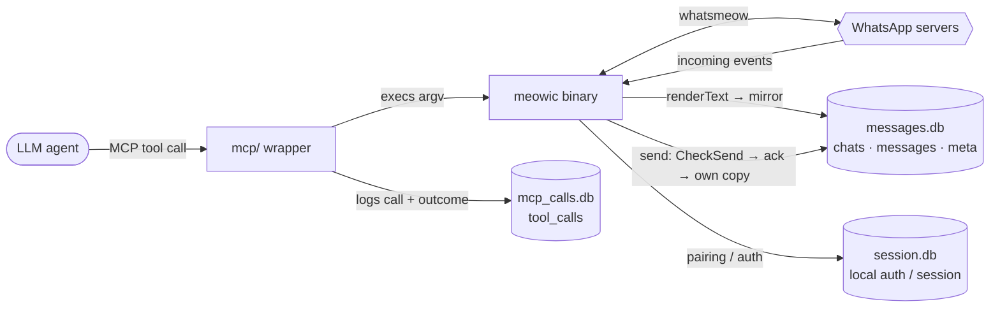

# meowic

An **MCP-wrappable CLI tool** built on the [whatsmeow](https://github.com/tulir/whatsmeow) Go library. meowic drives WhatsApp through whatsmeow and exposes a deliberately small, carefully selected slice of what that library can do. The MCP wrapper logs every MCP tool call and can be configured to run in read-only mode. Other GitHub projects built on whatsmeow expose its full capability surface; this is a simpler version that prioritizes safety over full functionality, with three levels of restriction:
 1- sending and receiving is ALWAYS text only no matter what.
 2- who can be messaged is fixed by a single compile-time rule in `/logic`, an allowlist that permits individuals only, so groups and channels are refused. Loosening it means editing that rule and recompiling, never flipping a runtime flag.
 3- sending can be switched off entirely at runtime with the `MEOWIC_READONLY` flag, the one level you *can* flip without recompiling. Blocked attempts are still logged.

## Project design and features

- **LLM agent monitoring** — Every MCP tool call is logged to `store/data/mcp_calls.db`
  (see [Data, storage & monitoring](#data-storage--monitoring)). There are 8 tools, 7 of which are read/status and only **1 write** (`send-message`).
- **No media, by design** — even though whatsmeow (and other projects built on
  it) support media sharing, in this project there is no file/media *sending*
  anywhere in the codebase, and no file-path parameter to add one. Inbound media
  is never stored as a payload; it's recorded as a text-only reference like
  `[image: 340KB]` or `[voice note: 0m42s, 180KB]`.
- **Individuals-only sending** — a hardcoded, compile-time rule in `logic/`
  refuses groups and channels; only individual contacts may be messaged, and no
  flag, config, or env var can loosen it. Other logic rules are just as easy to
  bake in: only send during work hours, auto-block foreign (non-local) numbers,
  or refuse anyone who isn't a saved contact. See **[CUSTOMIZE.md](CUSTOMIZE.md)**
  for the full menu of whatsmeow actions and `logic/` rules you can choose from.
- **Customizable** — nothing here is locked in. Following
  [CUSTOMIZE.md](CUSTOMIZE.md), you can add commands under `actions/` to expose
  more of whatsmeow — up to restoring full-power messaging — or bake new
  compile-time rules into `logic/`. The shipped build is just one
  deliberately-safe point on that spectrum.
Every command prints a single JSON envelope (`{"ok", "data", "error"}`) on
stdout.

## The tools

A quick human-readable tour (the agent gets the full contract from the
`docs://usage` resource):

| tool | what it does |
| --- | --- |
| `doctor` | overall health check + connection resync; first run does the one-time pairing |
| `list-chats` | recent chats from the local mirror (offline) |
| `list-messages` | recent messages in a chat, channel posts included (offline) |
| `get-group-info` | live group metadata |
| `get-newsletter-info` | live channel/newsletter metadata |
| `list-newsletter-messages` | live recent channel posts (backup read path) |
| `get-person-info` | identity for a person JID; resolves `@lid` → phone + contact status |
| `send-message` | the single write: text to one individual (full JID), policy-guarded |

## Set up the MCP and connect a CLI agent

**Prerequisites:** Go 1.25+ and a C compiler (the sqlite driver is CGO-based);
Node.js and npm (call-logging needs Node 22.5+); an MCP-capable CLI agent
(Claude Code, Codex, Cline, …).

```sh
# Clone
git clone https://github.com/faisalsardi-dev/meowic
cd meowic

# 1. Build the binary (CGO required — the sqlite driver is CGO-based)
CGO_ENABLED=1 go build -o meowic .

# 2. Pair — ONE TIME, in a terminal (interactive: enter your phone number,
#    then type the linking code on your phone)
./meowic doctor

# 3. Build the MCP wrapper
cd mcp
npm install
npm run build            # produces mcp/dist/index.js

# 4. Register it with your agent (Claude Code shown) — ships READ-ONLY: the
#    agent can read, but -e MEOWIC_READONLY=1 blocks send-message.
claude mcp add --scope user meowic -e MEOWIC_READONLY=1 -- node "$(pwd)/dist/index.js"

# 4.1 Write permission — ONLY if you want the agent to send. Re-register without
#     the read-only flag:
# claude mcp remove meowic
# claude mcp add --scope user meowic -- node "$(pwd)/dist/index.js"

# 5. Verify
claude mcp list          # meowic ✔ Connected
```

**Pairing detail (step 2):** with no existing session you're prompted for the
account's phone number (international format, digits only) and an 8-character
linking code is printed. Enter it on your phone: **WhatsApp → Settings → Linked
devices → Link a device → Link with phone number instead**. 

After pairing (step 2), `doctor` is something the **agent** calls for a health
check / connection resync — you don't need to run it again yourself. The agent discovers the command contract through `docs://usage`

The wrapper resolves the binary relative to its own location and runs it from
the repository root, so no machine-specific path is baked into the wrapper.

**Other MCP clients.** can be configured through the standard MCP JSON config:
```json
{
  "mcpServers": {
    "meowic": {
      "command": "node",
      "args": ["/absolute/path/to/meowic/mcp/dist/index.js"],
      "env": { "MEOWIC_READONLY": "1" }
    }
  }
}
```

## Data, storage & monitoring

### Data lifecycle



### Data storage

**`mcp_calls.db`** — the MCP tool-call log (written by the wrapper). It's a single
`tool_calls` table; each call fills only the columns relevant to it and leaves the
rest `NULL`, so a row's shape alone tells you what kind of call it was:

| column | type | notes |
| --- | --- | --- |
| `id` | INTEGER | primary key, autoincrement |
| `tool` | TEXT | the command called — always set |
| `jid` | TEXT | target / subject JID — `NULL` for tools that take none (`doctor`, `list-chats`) |
| `message` | TEXT | outbound text — `NULL` for everything except `send-message` |
| `limit_n` | INTEGER | the `[limit]` argument — `NULL` when the tool has no limit, or none was given |
| `ok` | INTEGER | `1` / `0` outcome — always set |
| `error` | TEXT | failure reason — `NULL` when `ok = 1` |
| `timestamp` | TEXT | ISO 8601 — always set |

Example
```sh
# Which log row recorded the agent sending "meet you tomorrow"?
sqlite3 store/data/mcp_calls.db \
  "SELECT id FROM tool_calls WHERE message LIKE '%meet you tomorrow%';"
```

**Responsibility note:** only calls that go *through the MCP* are logged. An agent
with shell access could bypass the log by running the CLI directly. 

**`messages.db`** — the local mirror meowic writes:

| table | columns |
| --- | --- |
| `chats` | `jid` (PK), `name`, `last_message_time` |
| `messages` | `id`, `chat_jid`, `sender_jid`, `from_me`, `timestamp`, `text` — PK `(id, chat_jid)` |
| `meta` | `key` (PK), `value` — e.g. `last_sync`, `last_send` |

**`session.db`** — whatsmeow's own device/session store (auth keys, prekeys,
contacts, the LID↔phone map). Its schema is owned by the library, not meowic;
the file is local and is chmod `0600` since it holds plaintext auth material (as is
`messages.db`; the `store/data/` dir itself is `0700`, re-applied on every run).

## (Optional) Use the CLI directly

> Only MCP-mediated calls are logged to `mcp_calls.db`.

Once built and paired (steps 1–2 above), you can run the commands yourself from
the repo root (it reads `./store/data/` there):

```sh
export MEOWIC_READONLY=1                                # read-only by default; run 'unset MEOWIC_READONLY' in terminal to allow send-message
./meowic doctor                                        # overall check-up + connection resync
./meowic list-chats [limit]                            # default limit 50
./meowic list-messages <chat-jid> [limit]              # includes channel/newsletter posts
./meowic get-group-info <group-jid>                    # e.g. 1203630212345@g.us
./meowic get-newsletter-info <newsletter-jid>          # e.g. 12036302xxxxx@newsletter
./meowic list-newsletter-messages <newsletter-jid> [limit]
./meowic get-person-info <person-jid>                  # e.g. 966512345678@s.whatsapp.net
./meowic send-message <jid> "<message>"                # e.g. ./meowic send-message 966512345678@s.whatsapp.net "hello there"
```

## Project structure

```
meowic/
├── client.go          # CLI router: parses argv, dispatches to actions/, prints the JSON envelope
├── meow.go            # whatsmeow ambassador — the ONLY file importing whatsmeow; owns pairing, event handling, renderText, Structure(), and SendText
├── doctor.go          # HealthReport: overall health check + connection resync
├── actions/           # one file per command; validates input SHAPE only (policy-free, reusable)
│   ├── list_chats.go            list_messages.go        get_group_info.go
│   ├── get_newsletter_info.go   list_newsletter_messages.go
│   └── get_person_info.go       send_message.go
├── logic/             # compile-time policy layer (hardcoded rules such as who may receive messages)
│   └── sending_messages_only_to_people.go   # CheckSend allowlist: individuals only
├── store/             # SQLite persistence layer
│   ├── store_manager.go   session_store.go   message_store.go
│   └── data/          # runtime databases (gitignored)
│       ├── session.db     # whatsmeow auth/session store
│       ├── messages.db    # local mirror: chats · messages · meta
│       └── mcp_calls.db   # MCP tool-call log: tool_calls
├── mcp/               # local Node MCP wrapper — exposes the CLI as an MCP server and logs every tool call
│   ├── src/index.ts   # 8 tools + docs://usage resource + tool_calls logging
│   ├── package.json   tsconfig.json   .gitignore   # dist/ + node_modules/ gitignored
├── scripts/
│   ├── verify.sh      # binary verification harness: offline regression tests + live verification checklist
│   └── mcpdocinital.txt # usage text mirrored into the MCP's docs://usage resource
├── CUSTOMIZE.md       # guide for exposing more whatsmeow capabilities and adding compile-time logic rules
├── README.md
├── go.mod
├── go.sum
└── meowic             # compiled binary (gitignored; built with CGO)
```
> The `store/data/` databases aren't part of the repo — meowic creates them
> itself: `session.db` when you pair, and `messages.db` + `mcp_calls.db` the first
> time each is needed.

## Extending & customizing

meowic is meant to be reshaped rather than forked-and-hacked, and two directories
are the seams. See **[CUSTOMIZE.md](CUSTOMIZE.md)** for full menu of whatsmeow capabilities and worked examples.
- **`actions/` — add capability.** Each command is one small file that validates
  only the *shape* of its input and then calls into `meow.go`; wiring up another
  whatsmeow capability is mostly a matter of adding a file here plus a route in
  `client.go`. 
- **`logic/` — add restriction.** Non-negotiable rules live here as compile-time
  checks, never flags or config. `CheckSend` is the working example (the
  individuals-only allowlist); the same pattern covers rules like auto-blocking
  foreign (non-local) numbers, work-hours-only sending, or a contacts-only policy —
  a condition added in `logic/`, enforced at the single send choke point and
  impossible to toggle off at runtime.

After reshaping `actions/` or `logic/`, run `scripts/verify.sh` — a dependency-free
harness that drives the compiled binary through its real CLI to confirm every
safety guarantee still holds (add a row for any new rule, then rebuild and run):

```sh
chmod +x scripts/verify.sh   # once — the script ships without the exec bit
CGO_ENABLED=1 go build -o meowic .
./scripts/verify.sh          # e.g. "35 passed, 0 failed"
```

---

>**Prompt injection risk.** As with many MCP servers and other Whatsapp MCP or CLI projects built on `whatsmeow` — including [`lharries/whatsapp-mcp`](https://github.com/lharries/whatsapp-mcp) and [`vicentereig/whatsapp-cli`](https://github.com/vicentereig/whatsapp-cli) — this tool combines access to private messages, exposure to untrusted incoming content, and an outbound send capability. That combination means a message you receive could contain text crafted to manipulate an LLM into leaking information or sending something the user never asked for. `meowic` is a deliberately restricted, safer take on this pattern: `send-message` refuses group and channel JIDs (it only messages individuals) and there is no file/media capability at all (see `CUSTOMIZE.md`), which materially narrows the risk compared to those projects. Ultimately, users remain responsible for deciding which MCP tools they expose to an LLM and what level of autonomy they grant it.

>**This is not an official WhatsApp integration.** `meowic` is built on [`whatsmeow`](https://github.com/tulir/whatsmeow) and is not sanctioned, reviewed, or endorsed by WhatsApp or Meta. This project exists for experimental and educational purposes: to explore how modern agentic frameworks (MCP, LLM tool use) can be built safely and responsibly around a personal messaging account. It is intended for exploratory, low-volume use, not automation at scale or anything resembling spam or abuse.
